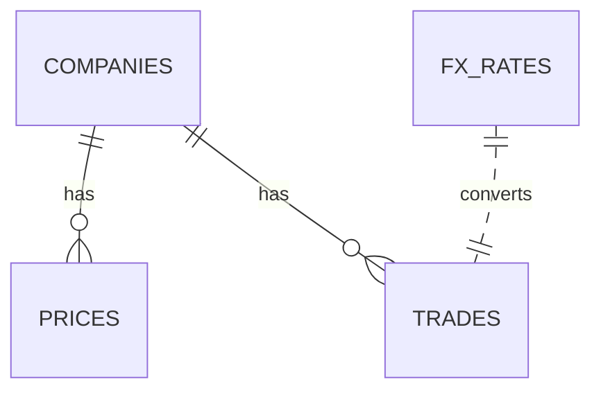

# SQL Finance Lab — Showcase
A compact, **concept-led** repository to demonstrate practical SQL skills for finance (markets data, trades, FX) with clear reasoning, comments, and documentation.

## Why this repo exists
- Show **data modeling** choices for market-style datasets.
- Demonstrate **query patterns** (joins, windows, CTEs) with explanations.
- Include **finance recipes** (returns, FX normalization, simple factors).
- Keep it **runnable locally** with SQLite for zero-friction evaluation.

## Quickstart
Linux/macOS (bash):
```bash
bash scripts/setup.sh
sqlite3 lab.db < sql/queries/00_basics.sql
```
Windows (PowerShell/CMD):
```bat
scripts\setup.bat
sqlite3 lab.db < sql\queries\00_basics.sql
```

## Contents
- `data/` toy but realistic CSVs (companies, prices, trades, fx_rates)
- `sql/` schema, seed, and queries from basics → analytics
- `docs/` concept notes (modeling, patterns, performance, finance recipes)
- `scripts/` setup for bash **and** Windows

## ERD (conceptual)


## What readers should look for
- Query headers that explain **intent and trade-offs**.
- Portable SQL (keeps to SQLite features unless noted).
- Honest caveats about toy data and z-score interpretability.

## Author & provenance
Created by **Fırat Akkaya** (Istanbul, Sep 2025) as a knowledge showcase during investment banking / corporate banking applications.
