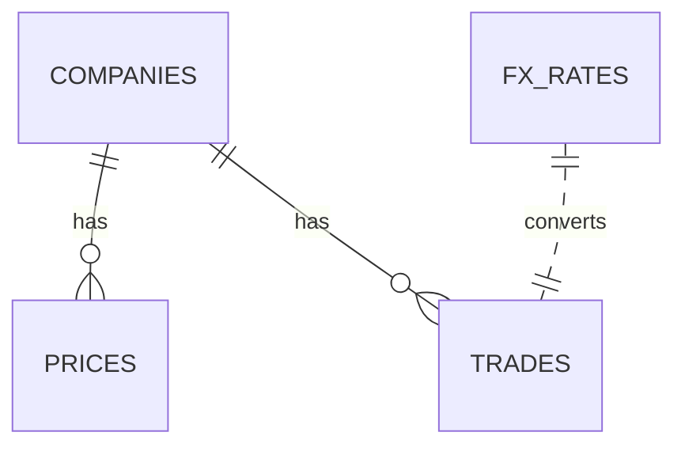

# SQL Baby Project 

This project is a small SQL lab I built to practice modeling financial data and queries, similar to tasks in corporate/investment banking
A repository to demonstrate practical SQL skills for finance (markets data, trades, FX) with  reasoning, comments, and documentation.

## Why this  exists
- Show data modeling choices for market style datasets.
- Demonstrate query patterns (joins, windows, CTEs) with explanations.
- Include finance recipes (returns, FX normalization, simple factors).
- Keep it runnable locally with SQLite for zero friction evaluation.

## Quickstart
Linux/macOS (bash):
```bash
bash scripts/setup.sh
sqlite3 lab.db < sql/queries/00_basics.sql
```
Windows (PowerShell/CMD):
```bat
scripts\setup.bat
sqlite3 lab.db < sql\queries\00_basics.sql
```

## Contents
- `data/` toy but realistic CSVs (companies, prices, trades, fx_rates)
- `sql/` schema, seed, and queries from basics
- `docs/` concept notes (modeling, patterns, performance, finance recipes)
- `scripts/` setup for bash or windows

## ERD (conceptual)


