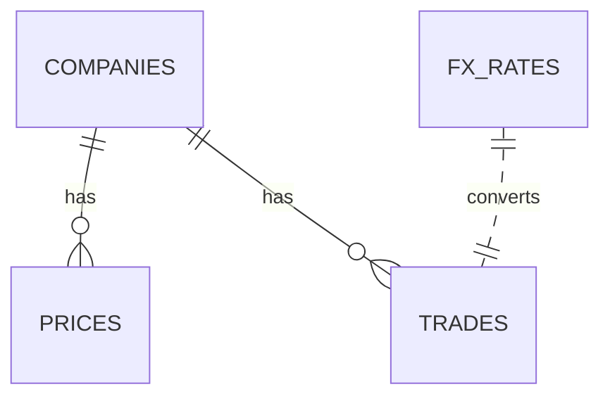

# Data Modeling for Markets Data

- Tickers/identifiers
- Prices: one row per ticker-date (close)
- Trades: event table with timestamps
- FX: one row per ccy-date

```mermaid
erDiagram
COMPANIES ||--o{ PRICES : has
COMPANIES ||--o{ TRADES : has
FX_RATES ||..|| TRADES : converts
```
